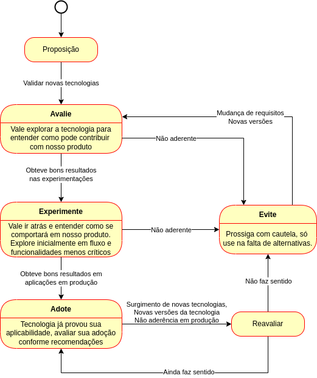

# Ciclo de vida

Dentro do ciclo de vida do **tech radar** as tecnologias são classificadas pela recomendação de adoção: `Evite`, `Avalie`, `Experimente` e `Adote`.

- **Evite** - Usado para tecnologias ainda não comprovadas pelo mercado, mas também para dizer *“não inicie nada novo com esta tecnologia”*.
- **Avalie** - Indica tecnologias que valem a pena ser exploradas, com o objetivo de entender como seu impacto (positivo ou negativo). Nesta fase deve-se investir algum esforço em estudos, pesquisa e provas de conceito, antes de passar a utilizá-la.
- **Experimente** - Reservado para tecnologias que entendemos que valem a pena para o nosso produto, porém ainda não provamos em larga escala.
- **Adote** - Tecnologia já provou sua aplicabilidade, avaliar sua adoção conforme recomendações.

